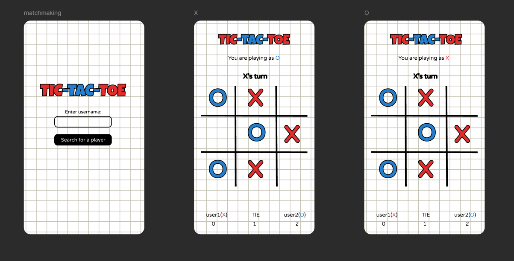
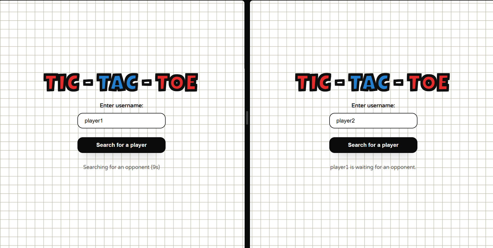
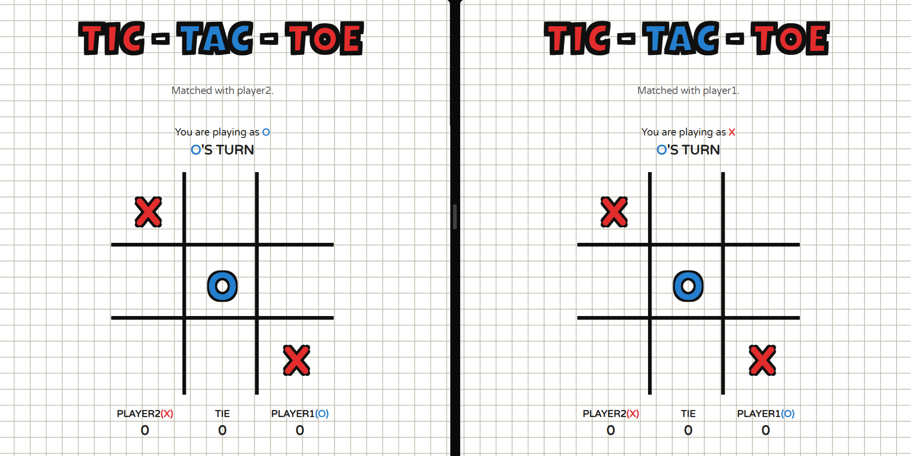
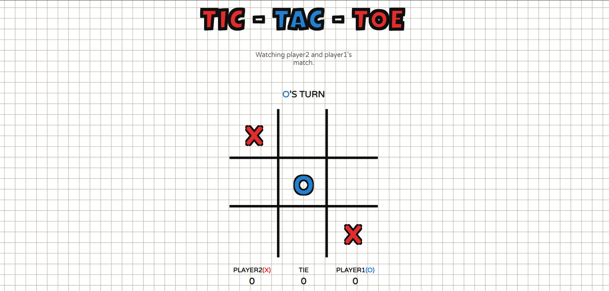
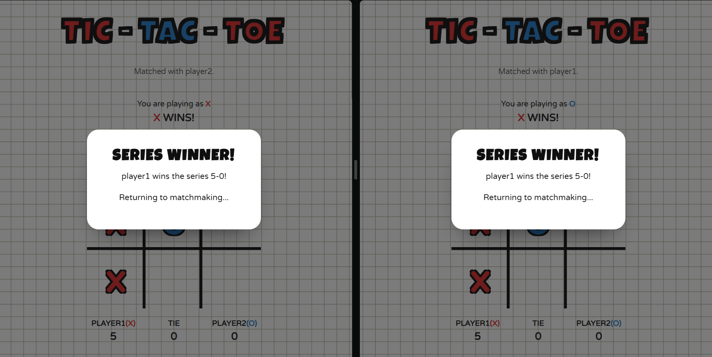

# Realtime Tic-Tac-Toe

A lightweight multiplayer Tic-Tac-Toe experience that keeps the entire table in sync through Socket.IO. Players join with a username, get matched in real time, and the board, score tracker, and lobby status update instantly for everyone watching.

## Figma Design


## Screenshots





## Features
- **Realtime matchmaking** � seat assignment for X and O with a 10-second opponent search countdown and automatic lobby reset when no match is found.
- **Spectator-friendly lobby** � additional clients watch active matches and see live status updates like "daven is waiting for an opponent" or who is currently playing.
- **Authoritative gameplay** � the server validates moves, enforces turn order, and resolves wins or draws before broadcasting state updates.
- **Auto round flow** � games reset 1.5s after each round, while a modal celebrates the first player to reach five wins and returns both players to matchmaking after a short delay.
- **Persistent scoreboard** � tracks wins for X and O plus draws across the current series.
- **Resilient UI copy** � lobby messaging survives reconnects and clearly explains what is happening (searching, matched, waiting for seat, etc.).

## Tech Stack
- **Node.js** + **Express** for the HTTP server and static asset delivery.
- **Socket.IO** for realtime bidirectional communication between clients and server.
- **HTML**, **CSS**, and **Vanilla JavaScript** for the front-end UI.
- **Nodemon** (dev dependency) for live-reload during development.

## Getting Started
1. **Install dependencies**
   ```bash
   npm install
   ```
2. **Run the server**
   ```bash
   npm start
   ```
   For auto-reload while developing:
   ```bash
   npm run dev
   ```
3. **Open the client** � visit `http://localhost:3000` in one or more browser tabs to play or spectate.

## Project Structure
```
.
+-- index.js          # Express + Socket.IO server
+-- index.html        # Client application (UI + Socket.IO client logic)
+-- style.css         # Styling for lobby, board, modal, etc.
+-- grid-background.png
+-- package.json
+-- package-lock.json
+-- .gitignore
```

## Development Notes
- The server keeps minimal in-memory state (`players`, `board`, `turn`). Restarting the server resets the match.
- Adjust matchmaking timings in `index.html` via `SEARCH_TIMEOUT_MS`, `AUTO_RESET_DELAY_MS`, and `SERIES_EXIT_DELAY_MS`.
- Static assets are served directly from the project root by Express; no bundler or build step is required.

## License
This project is distributed under the ISC license. See `package.json` for details.
